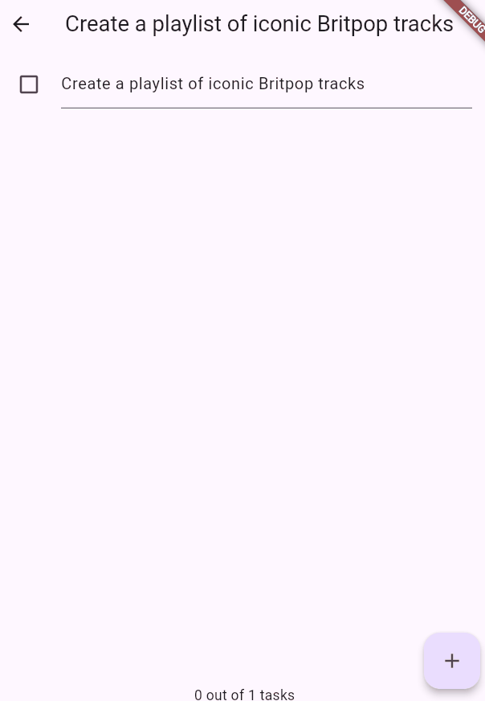
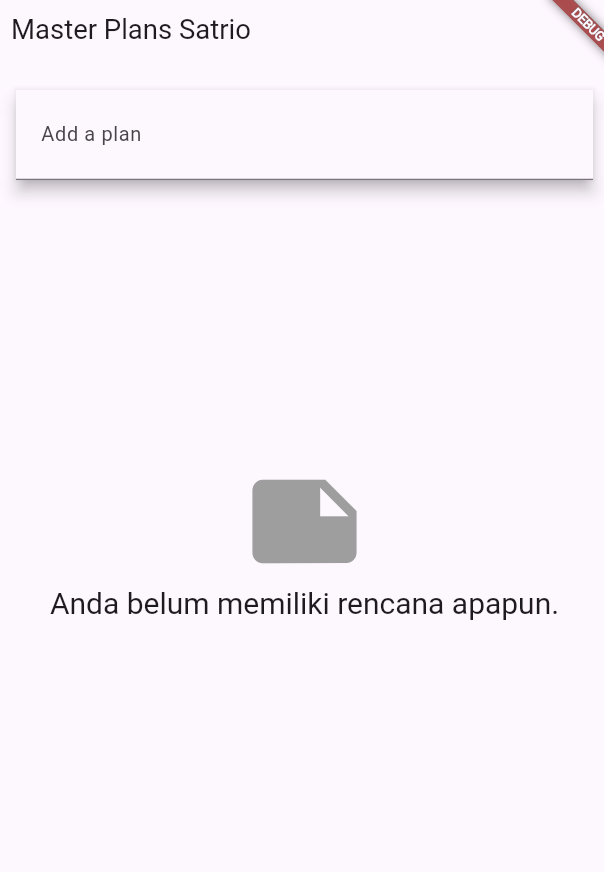

# Laporan Jobsheet 10 - State: Model-View, InheritedWidget, Multiple Screens

**Nama:** Satrio Wisnu Adi Pratama  
**NIM:** 2341720219  
**Kelas:** TI-3E

## Tujuan

Mempelajari pengelolaan state dasar menggunakan pola model–view, memahami penggunaan `InheritedWidget`/`InheritedNotifier`, serta menerapkan state yang dapat digunakan di beberapa screen (multi-screen).

---

## Praktikum 1: Dasar State dengan Model-View

### Tujuan

Membangun aplikasi Master Plan yang memiliki model `Plan` dan `Task`, memisahkannya dari tampilan, dan menggunakan pendekatan immutable ketika memperbarui state.

### Ringkasan Implementasi

- Membuat file model `task.dart` dan `plan.dart`.
- Menggabungkan ekspor model melalui `models/data_layer.dart`.
- `main.dart` menampilkan `PlanScreen` sebagai halaman awal dan mengatur tema aplikasi.
- `PlanScreen` menggunakan `StatefulWidget` untuk menampilkan daftar tugas (via `ListView`) dan tombol tambah (`FloatingActionButton`).
- Setiap perubahan (tambah, edit, checklist) menghasilkan objek `Plan` baru sebagai bagian dari penggunaan immutable state.
- Menambahkan `ScrollController` untuk menghilangkan fokus input ketika layar digeser, serta menambahkan `dispose()` agar controller dibersihkan.

### GIF Hasil

Praktikum 1 — tampak pada GIF berikut:  

### Penjelasan poin penting

- Pada Langkah 4, `data_layer.dart` dibuat sebagai indeks ekspor model. Dengan begitu, view cukup mengimpor satu file saja meskipun model terus bertambah.
- Variabel `plan` pada `PlanScreen` menjadi representasi state lokal berupa daftar tugas. Penggunaan `const Plan()` berguna sebagai nilai awal yang bersifat immutable, efisien, dan aman dalam null-safety.
- GIF `JB10_1` menggambarkan penambahan tugas, pengetikan deskripsi, serta menandai tugas selesai. Setiap perubahan membuat salinan baru dari `Plan` dan daftar `Task` untuk menjaga prinsip immutability.

### Fungsi method pada Langkah 11 dan 13 (lifecycle)

- `initState()` digunakan untuk membuat `ScrollController` dan menambahkan listener agar fokus input hilang ketika dilakukan scroll.
- `dispose()` dipanggil saat widget dihapus dari tree, digunakan untuk membersihkan controller agar tidak terjadi kebocoran memori.

---

## Praktikum 2: Mengelola Data Layer dengan InheritedWidget dan InheritedNotifier

### Tujuan

Memindahkan penyimpanan state dari widget view ke provider yang berbasis `InheritedNotifier`, memungkinkan banyak widget berlangganan pada perubahan state tanpa menyimpan state lokal yang berlebihan.

### Ringkasan Implementasi

- Membuat `provider/plan_provider.dart` berisi `PlanProvider extends InheritedNotifier<ValueNotifier<Plan>>`.
- Pada `main.dart`, aplikasi dibungkus dengan `PlanProvider` yang membawa `ValueNotifier<Plan>(const Plan())`.
- Operasi update state di `PlanScreen` diubah untuk membaca dan menulis melalui `ValueNotifier<Plan>` yang diperoleh dari `PlanProvider.of(context)`.
- Menggunakan `ValueListenableBuilder<Plan>` agar bagian tampilan yang membutuhkan data dapat otomatis rebuild ketika nilai berubah.

### Apa itu InheritedWidget pada Langkah 1? Mengapa InheritedNotifier?

- `InheritedWidget` berfungsi untuk menyediakan data yang dapat diakses widget anak tanpa harus mengoper nilai secara manual melalui constructor.
- `InheritedNotifier` mempermudah penggunaan objek `Listenable` (seperti `ValueNotifier`) sehingga perubahan state dapat diberitahukan ke seluruh widget yang membutuhkan. Kombinasi ini membuat pengelolaan state lebih ringkas dibandingkan membuat sistem notifikasi manual.

### Maksud method pada Langkah 3 (model `Plan`)

- `completedCount` menghitung jumlah tugas yang sudah selesai.
- `completenessMessage` menghasilkan ringkasan progres.
- Menempatkan perhitungan di model membuat kode view lebih bersih dan memudahkan penggunaan ulang logic.

---

## Praktikum 3: Membuat State di Multiple Screens

### Tujuan

Mengembangkan aplikasi agar mampu menangani banyak plan sekaligus dan memungkinkan navigasi antar screen dengan tetap mempertahankan state yang konsisten.

### Ringkasan Implementasi

- `PlanProvider` diubah menjadi membawa `ValueNotifier<List<Plan>>` sehingga dapat menyimpan banyak plan.
- Membuat `PlanCreatorScreen` untuk menambahkan plan baru menggunakan `TextEditingController`.
- Mengubah `PlanScreen` agar menerima objek `Plan` tertentu sebagai parameter; kemudian memilih plan tersebut dari daftar dalam provider.
- Saat plan diperbarui, list plan diperbarui dengan membuat salinan list lalu mengganti elemen pada indeks target.

### Penjelasan diagram (lift state up / navigation)

Diagram menjelaskan bahwa `PlanProvider` ditempatkan pada level atas (di atas `MaterialApp`), sehingga semua screen mempunyai akses ke state. Dengan menaruh state pada parent, screen-screen yang berbeda dapat membaca/mengubah data yang sama tanpa kehilangan state antar-navigasi. Inilah konsep "mengangkat state" (lift state up).

### GIF Hasil Praktikum 3

Praktikum 3 — lihat GIF berikut:  

---

## Kesimpulan & Catatan

- Praktikum 1 mempelajari pemisahan model–view dan penggunaan pola immutable dalam pengelolaan state.
- Praktikum 2 memindahkan pengelolaan state ke `InheritedNotifier`, membuat struktur view lebih rapi dan data lebih mudah diakses.
- Praktikum 3 mengimplementasikan state untuk banyak screen dengan menempatkan state di level lebih tinggi agar dapat dibagikan ke seluruh bagian aplikasi.

---
