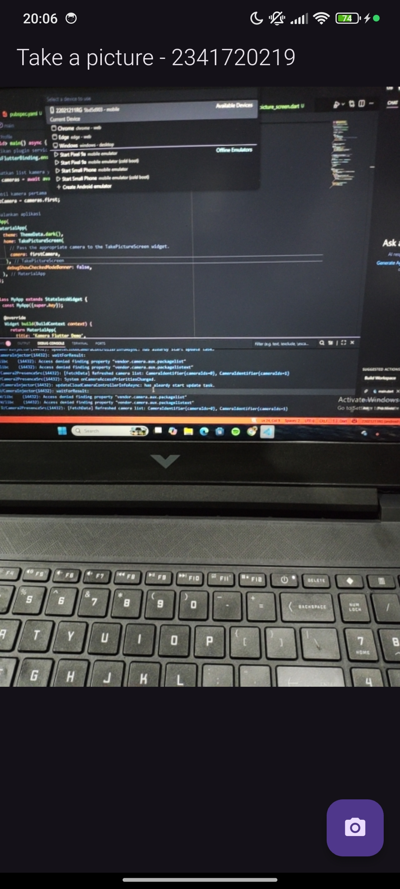
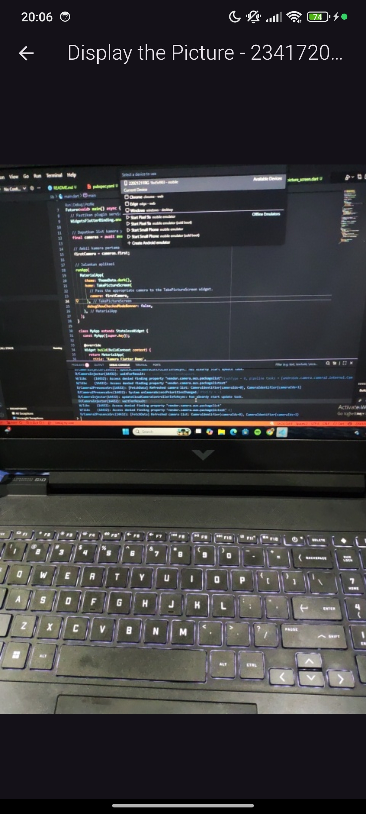
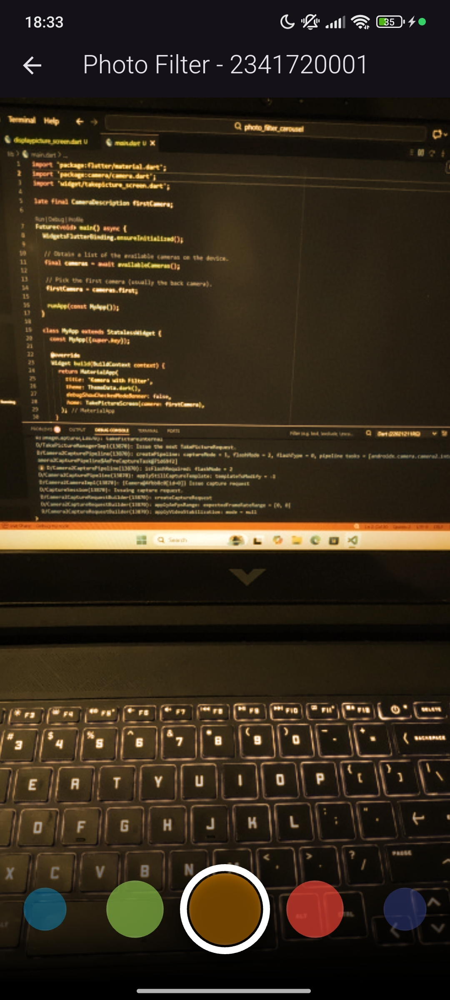
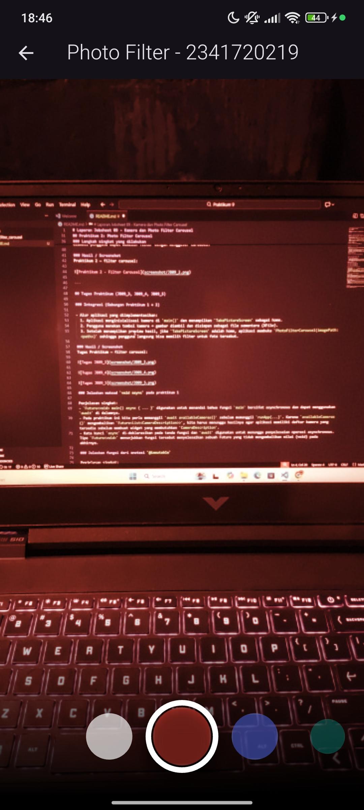
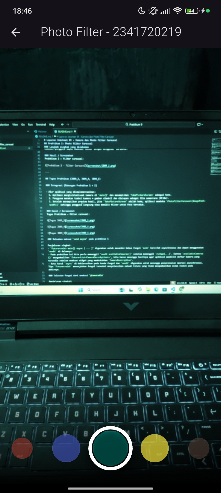

# Jobsheet 09 – Kamera dan Photo Filter Carousel

**Nama:** Satrio Wisnu Adi Pratama  
**NIM:** 2341720210  
**Kelas:** TI-3E  

---

## 1. Deskripsi Umum

Jobsheet ini berfokus pada implementasi fitur pengambilan gambar menggunakan plugin `camera` pada Flutter, serta integrasi *photo filter carousel* untuk memungkinkan pengguna menerapkan filter warna pada foto yang telah diambil. Mahasiswa diharapkan memahami alur kerja kamera, penyimpanan file sementara, serta manipulasi gambar menggunakan widget Flutter.

---

## 2. Praktikum 1: Pengambilan Foto Menggunakan Kamera

### 2.1 Tujuan
Mengimplementasikan proses akses kamera perangkat, menampilkan *live preview*, mengambil foto, serta menampilkan hasil pengambilan gambar pada layar terpisah.

### 2.2 Langkah Implementasi
- Menambahkan dependensi:  
  - `camera`  
  - `path_provider`  
  - `path`
- Melakukan inisialisasi *binding* dan kamera pada fungsi `main()` dengan `WidgetsFlutterBinding.ensureInitialized()` dan `await availableCameras()`.
- Membuat `TakePictureScreen` sebagai `StatefulWidget` yang:
  - Menginisialisasi `CameraController` pada `initState()`.
  - Menghentikan controller pada `dispose()`.
- Menampilkan *preview* kamera menggunakan `CameraPreview` melalui `FutureBuilder` setelah proses inisialisasi selesai.
- Mengambil gambar dengan `_controller.takePicture()` kemudian mengarahkannya ke layar `DisplayPictureScreen`.

### 2.3 Hasil
**Tangkapan layar hasil praktikum pengambilan foto:**

  

---

## 3. Praktikum 2: Photo Filter Carousel

### 3.1 Tujuan
Menerapkan mekanisme pemilihan filter warna melalui *carousel* untuk memodifikasi foto yang telah diambil.

### 3.2 Langkah Implementasi
- Membuat widget:
  - `FilterItem`
  - `FilterSelector` (berbentuk *carousel*)
  - `CarouselFlowDelegate` (mengatur tata letak Flow)
  - `PhotoFilterCarousel`
- `PhotoFilterCarousel` menerima parameter path gambar dan menampilkannya menggunakan `Image.file()` dengan nilai `color` dan `colorBlendMode` yang disesuaikan dengan filter yang dipilih.
- Mengintegrasikan alur aplikasi sehingga setelah foto diambil, pengguna langsung diarahkan ke halaman filter.

### 3.3 Hasil
**Tangkapan layar hasil implementasi filter carousel:**

---

## 4. Tugas Praktikum (JB09_3, JB09_4, JB09_5)

### 4.1 Integrasi Kamera dan Carousel Filter

Alur aplikasi yang telah diterapkan:
1. Aplikasi menginisialisasi kamera pada fungsi `main()` dan menampilkan `TakePictureScreen`.
2. Pengguna mengambil gambar menggunakan tombol kamera.
3. Hasil foto disimpan sebagai file sementara (`XFile`).
4. Aplikasi menampilkan halaman filter (`PhotoFilterCarousel`) untuk memungkinkan pengguna memilih filter warna.

### 4.2 Hasil
  
  

---

## 5. Pertanyaan dan Jawaban

### 5.1 Jelaskan maksud `void async` pada praktikum 1
Fungsi `main()` ditulis sebagai `Future<void> main() async` untuk menandakan bahwa fungsi tersebut bersifat asynchronous. Hal ini diperlukan karena proses inisialisasi kamera menggunakan `await availableCameras()`, yang merupakan operasi asynchronous. Dengan demikian, eksekusi dapat menunggu penyelesaian proses sebelum melanjutkan ke `runApp()`.

### 5.2 Jelaskan fungsi anotasi `@immutable`
Anotasi `@immutable` (dari paket `meta`) digunakan untuk menandai bahwa suatu kelas bersifat *immutable*, yaitu seluruh field-nya harus bersifat `final`. Anotasi ini memberi peringatan jika terdapat field yang tidak final, sehingga membantu menjaga kestabilan state pada widget, khususnya `StatelessWidget`.

### 5.3 Jelaskan fungsi anotasi `@override`
Anotasi `@override` digunakan untuk menyatakan bahwa suatu method pada kelas turunan menggantikan method pada superclass. Anotasi ini meningkatkan keterbacaan kode dan membantu analyzer mendeteksi kesalahan ketika nama method atau parameternya tidak sesuai dengan method yang ingin diganti.

---

## 6. Kesimpulan

Melalui Jobsheet 09, mahasiswa mempelajari implementasi kamera pada Flutter, mulai dari inisialisasi, pengambilan foto, hingga penyajian hasil. Selain itu, aplikasi diperluas dengan fitur *photo filter carousel* untuk memberikan kemampuan manipulasi gambar secara interaktif. Keseluruhan praktikum memberikan pemahaman komprehensif terkait pemanfaatan plugin kamera dan pengolahan visual dalam Flutter.

