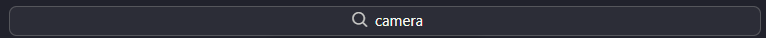
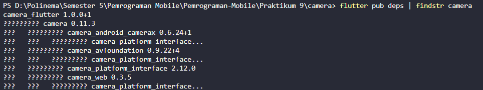
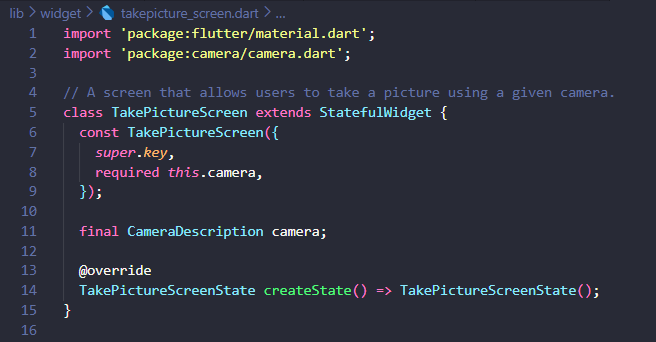
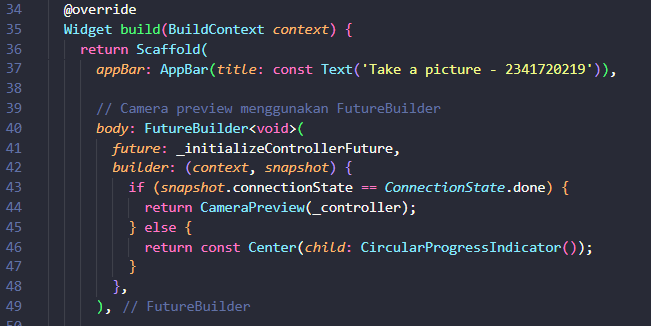
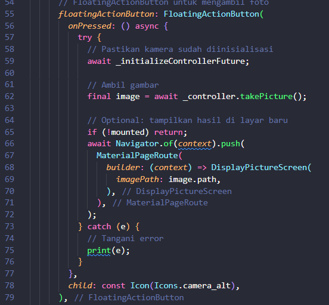
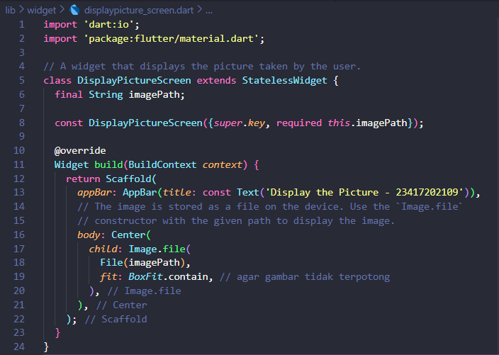
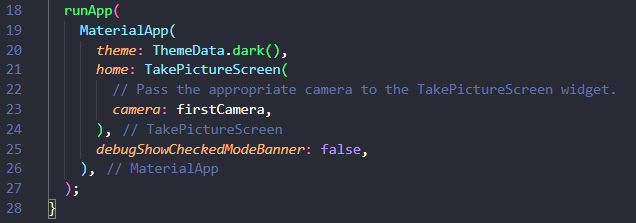
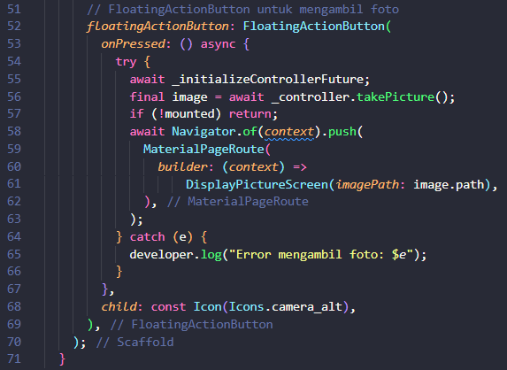

# Kamera Flutter

## Deskripsi Proyek
Project **kamera_flutter** adalah aplikasi Flutter sederhana yang memungkinkan pengguna untuk mengambil foto menggunakan kamera perangkat, menampilkan preview kamera, dan menampilkan hasil foto yang telah diambil.

Aplikasi ini menggunakan tiga dependensi utama:
- **camera** → untuk bekerja dengan kamera perangkat.
- **path_provider** → untuk mendapatkan path penyimpanan hasil foto.
- **path** → untuk memudahkan manipulasi path lintas platform.

---

## Langkah-langkah Praktikum 1

### Langkah 1: Buat Project Baru
Buat project Flutter baru dengan nama `kamera_flutter`.  
Sesuaikan style laporan praktikum sesuai ketentuan.

---

### Langkah 2: Tambah Dependensi
Tambahkan dependensi dengan perintah berikut di terminal:  

Tambahkan permission di file `Info.plist` (iOS):  

---

### Langkah 3: Ambil Sensor Kamera dari Device
Pastikan plugin sudah diinisialisasi sebelum `runApp()` dan ambil daftar kamera dari device.

Ubah `void main()` menjadi fungsi **async**:  

---

### Langkah 4: Buat dan Inisialisasi CameraController
Buat StatefulWidget bernama `TakePictureScreen` untuk mengontrol kamera.  

- Tambahkan variabel `CameraController` dan `Future` untuk inisialisasi.  
- Inisialisasi controller di `initState()`.  
- Hapus controller di `dispose()`.

---

### Langkah 5: Tampilkan Preview Kamera
Gunakan **CameraPreview** dan **FutureBuilder** untuk menunggu proses inisialisasi sebelum menampilkan kamera.

---

### Langkah 6: Ambil Foto dengan CameraController
Tambahkan **FloatingActionButton** untuk mengambil foto.

- Pastikan kamera sudah diinisialisasi sebelum mengambil foto.  
- Bungkus operasi dalam blok try/catch untuk menangani error.

---

### Langkah 7: Buat Widget `DisplayPictureScreen`
Buat file `displaypicture_screen.dart` untuk menampilkan foto yang diambil.

---

### Langkah 8: Edit `main.dart`
Jalankan aplikasi dengan passing kamera ke widget `TakePictureScreen`.

---

### Langkah 9: Menampilkan Hasil Foto
Edit callback tombol untuk menampilkan foto di layar baru menggunakan `Navigator`.

- Pastikan kamera sudah diinisialisasi sebelum mengambil foto.  
- Hasil foto ditampilkan pada layar baru menggunakan widget `DisplayPictureScreen`.

## Hasil Percobaan Praktikum 1

